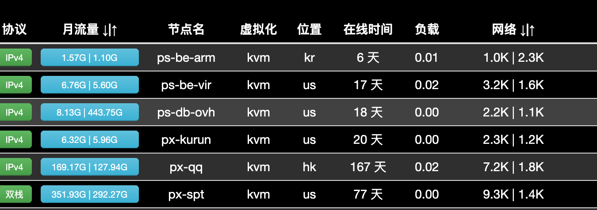

# 支持节点管理和监控的 ServerStatus，它来了

原文地址：https://lidalao.com/archives/87


## 介绍

项目地址：https://github.com/lidalao/ServerStatus  
项目基于 cppla 版本 ServerStatus， 增加如下功能：

- 更方便的节点管理, 支持增删改查
- 上下线通知（telegram）
- Agent 机器安装脚本改为 systemd， 支持开机自启

## 安装

在服务端复制以下命令，一键到底。请记得替换成你自己的 YOUR_TG_CHAT_ID 和 YOUR_G_BOT_TOKEN。

其中，Bot token 可以通过@BotFather 创建机器人获取， Chat id 可以通过@getuserID 获取。

```bash
wget --no-check-certificate https://raw.githubusercontent.com/jumploop/ServerStatus/master/shell/sss.sh && chmod +x ./sss.sh && sudo ./sss.sh YOUR_TG_CHAT_ID YOUR_TG_BOT_TOKEN
```

安装成功后，web 服务地址：http://ip:8081

通过\_sss.py 脚本，可以很方便的进行节点的增删改查操作。特别在添加新节点时，会有提示如何在新节点安装对应的 agent 服务。如果你想了解更多，可以看看进阶部分，不看也足够用。

## 进阶

由于没改动 ServerStatus 代码，理论上，任何版本的 ServerStatus 都可以用\_sss.py 来做管理， 都可以用 bot-telegram.py 来进行上下监控。

节点管理时，把\_sss.py 放到和 config.json 同一目录，运行 python3 \_sss.py 即可,默认配置文件 config.json 和脚本在同一目录，ServerStatus 服务重启命令为`docker-compose restart`。支持传入重启 ServerStatus 服务命令和 config.json 配置文件路径，改成你对应的服务启动方式和配置文件路径，例如用 systemd,则传入`systemctl restart ServerStatus`。

```bash
python _sss.py -a 'systemctl restart ServerStatus' -c config.json
```

接下来是上下线监控服务，同样适用于任何版本的 ServerStatus。 bot-telegram.py, 可以跑在任何机器上，不是必须在服务端，丢在家里 nas 上也成。

bot-telegram.py 里面有三个配置信息，bot_token, cat_id 和 NODE_STATUS_URL, 改成你自己的对应信息，NODE_STATUS_URL 需要改成你自己的探针 web 服务地址，例如，域名探针https://tz.test.com, 则改为https://tz.test.com/json/stats.json。配置修改完后，运行python3 bot-telegram.py 即可开始监控
